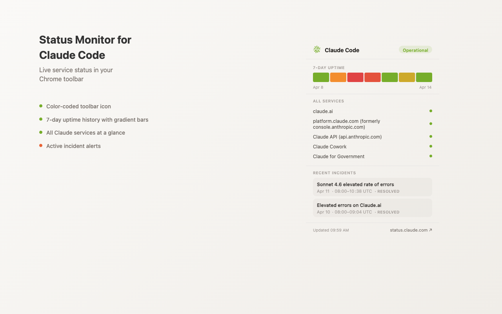

# Claude Code Status

A Chrome extension that shows the live status of Claude Code in your browser toolbar.



## Features

- **Toolbar icon** — a Claude spark icon that changes color based on current Claude Code status (green/orange/red)
- **Tooltip** — hover to see the current status at a glance ("Claude Code: Operational")
- **7-day history bar** — colored bar segments showing daily status, with hover tooltips showing outage type and duration
- **Other services** — compact view of all Claude services (claude.ai, API, platform, Cowork, Government)
- **Recent incidents** — last 7 days of incidents affecting Claude Code, with color-coded status labels for active incidents
- **Light/dark theme** — follows your system theme automatically
- **Auto-refresh** — polls status.claude.com every 30 seconds

## Install

### From source (developer mode)

1. Clone this repo
2. Open `chrome://extensions/` in Chrome
3. Enable **Developer mode** (toggle in top-right)
4. Click **Load unpacked** and select the cloned directory
5. The Claude spark icon appears in your toolbar

### From Chrome Web Store

*Coming soon*

## How it works

The extension polls the [Statuspage.io public API](https://status.claude.com/api/v2/summary.json) for Claude's service status. A background service worker fetches data every 30 seconds using `chrome.alarms`, processes it, and caches results in `chrome.storage.local`. The popup reads cached data on open — no network requests when you click the icon.

### Status colors

Colors match [status.claude.com](https://status.claude.com):

| Status | Bar color | Meaning |
|--------|-----------|---------|
| Operational | Green (`#76AD2A`) | All systems normal |
| Degraded Performance | Orange (`#E86235`) | Elevated errors or latency |
| Partial Outage | Orange (`#E86235`) | Some functionality affected |
| Major Outage | Red (`#E04343`) | Service significantly impacted |

### Permissions

- **`alarms`** — periodic polling every 30 seconds
- **`storage`** — cache status data locally
- **`host_permissions: status.claude.com`** — fetch status API

No user data is collected or transmitted. See [Privacy Policy](PRIVACY.md).

## Project structure

```
├── manifest.json       # Chrome extension manifest (V3)
├── background.js       # Service worker: polling, data processing, icon rendering
├── popup.html          # Popup markup
├── popup.js            # Popup rendering logic
├── popup.css           # Light/dark theme styles
└── icons/              # Static fallback icon PNGs
```

## License

MIT
